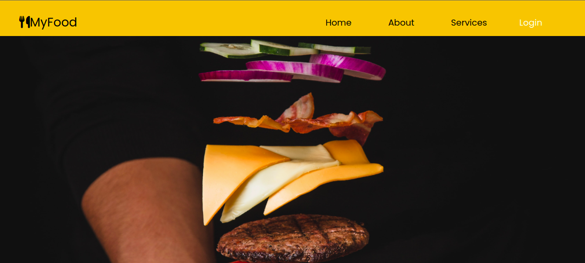

## MyFood
This is the name of the website.

## Description
This website enables customers to  order food at the comfort of their zone.
## Screenshot

## Features
As a user of the application,you will be able to:
 * Make enquiry through contact us link .
 * Know more about the website and services offered.

## Requirements
* Acces to internet 
* Access to a computer or a mobile phone.

## live-link
link = https://koskei57.github.io/phase-1-project/

 ## Installation
For one to use the website, you will have to git clone the repository link into your visual code and run the html file.

This is achieved using:
GIT CLONE:git@github.com:Koskei57/phase-1-project.git
## Technology-Used
* Html and Cascading style sheet were employed during the structuring and styling of the web page. 
* Javascript language to program the beahaviour of our website.
* Json server file used to store sample data for our website.

## License
Copyright (c) [2022] [Dennis Cheruiyot] Permission is hereby granted, free of charge, to any person obtaining a copy of this software and associated documentation files (the "Software"), to deal in the Software without restriction, including without limitation the rights to use, copy, modify, merge, publish, distribute, sublicense, and/or sell copies of the Software, and to permit persons to whom the Software is furnished to do so, subject to the following conditions: The above copyright notice and this permission notice shall be included in all copies or substantial portions of the Software.

THE SOFTWARE IS PROVIDED "AS IS", WITHOUT WARRANTY OF ANY KIND, EXPRESS OR IMPLIED, INCLUDING BUT NOT LIMITED TO THE WARRANTIES OF MERCHANTABILITY, FITNESS FOR A PARTICULAR PURPOSE AND NONINFRINGEMENT. IN NO EVENT SHALL THE AUTHORS OR COPYRIGHT HOLDERS BE LIABLE FOR ANY CLAIM, DAMAGES OR OTHER LIABILITY, WHETHER IN AN ACTION OF CONTRACT, TORT OR OTHERWISE, ARISING FROM, OUT OF OR IN CONNECTION WITH THE SOFTWARE OR THE USE OR OTHER DEALINGS IN THE SOFTWARE.

## Author-name
Dennis Cheruiyot student at Moringa School, Nairobi.

## contacts
Incase of any errors contact me on:
Email address:denoowkoske@gmail.com slack:Dennis